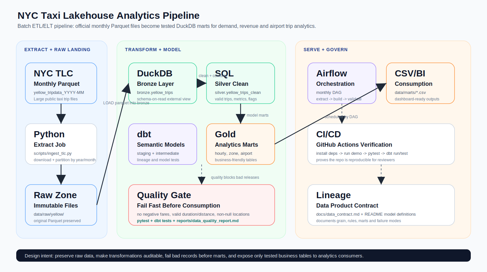

# NYC Taxi Lakehouse

[](https://github.com/npgb2505/nyc-taxi-lakehouse/actions/workflows/ci.yml)
[](https://www.python.org/)
[](https://duckdb.org/)
[](LICENSE)

A reproducible batch data pipeline that lands NYC TLC Parquet files, quarantines invalid trips, models bronze/silver/gold tables in DuckDB, and publishes tested demand, zone-revenue, and airport marts.



## Why this project

Monthly taxi files are useful only when their schema, validity, lineage, and delivery are controlled. This project demonstrates the full path from an immutable raw landing zone to analytics-ready data products, including failure handling and release gates - not only a notebook analysis.

## Verified demo

The deterministic demo below is executed by CI and can be reproduced locally. Five malformed trips are injected intentionally to prove that quarantine and reconciliation work.

| Result | Verified value |
|---|---:|
| Raw trips processed | 500 |
| Accepted / quarantined | 495 / 5 |
| Acceptance rate | 99.0% |
| Data-quality gates | 9 passed |
| Pickup zones represented | 10 |
| Airport trips in clean data | 98 |
| Reconciled rows | 500 / 500 |

These are deterministic validation metrics, not production traffic benchmarks. The same pipeline can ingest official monthly [NYC TLC trip records](https://www.nyc.gov/site/tlc/about/tlc-trip-record-data.page).

## Quick start

```bash
python -m venv .venv
# Windows: .venv\Scripts\activate
# macOS/Linux: source .venv/bin/activate
pip install -r requirements.txt
python scripts/run_demo.py --rows 500 --invalid-rows 5
```

The command generates repeatable sample data, builds the warehouse and marts, runs all quality gates, and writes both human-readable and machine-readable reports.

## Data flow

```text
NYC TLC Parquet / deterministic sample
  -> partitioned raw files (year=YYYY/month=MM)
  -> bronze.yellow_trips
  -> silver.yellow_trips_clean
     + silver.yellow_trips_rejected (reason attached)
  -> gold.mart_hourly_demand
     gold.mart_zone_revenue
     gold.mart_airport_trips
  -> CSV data products + quality reports
```

| Layer | Grain | Responsibility |
|---|---|---|
| Bronze | Source trip | Preserve source columns and support replay |
| Silver clean | Valid trip | Type, constrain, derive duration and airport flag |
| Silver rejected | Invalid trip | Preserve failed rows with one or more rejection reasons |
| Gold hourly | Date and hour | Demand, passengers, duration, distance, revenue |
| Gold zone | Pickup zone | Trips, revenue, tips, distance, average ticket |
| Gold airport | Date | Airport volume, revenue, tip rate, duration |

## Reliability controls

- Idempotent ingestion skips existing non-empty files unless `--force` is passed.
- Downloads use retry/backoff and atomic `.part` file replacement.
- Invalid trips are quarantined instead of disappearing from the pipeline.
- A reconciliation gate enforces `raw = clean + rejected`.
- Nine SQL quality gates check validity, uniqueness, dimension coverage, and non-empty marts.
- dbt tests validate model keys and required fields.
- pytest exercises deterministic generation, invalid input handling, quarantine, and end-to-end marts.
- GitHub Actions rebuilds the pipeline and dbt models on every push and pull request.

Reports are written to:

```text
reports/data_quality_report.md
reports/data_quality_report.json
```

## Run with official NYC TLC data

```bash
python scripts/ingest_tlc.py --trip-type yellow --year 2024 --month 1
python scripts/build_lakehouse.py
python scripts/data_quality.py
```

The downloader writes to `data/raw/yellow/year=2024/month=01/`. Raw data and generated warehouses are intentionally excluded from Git.

## dbt and orchestration

The dbt project provides a second, reviewable transformation layer over curated DuckDB tables:

```bash
cd dbt
dbt debug --profiles-dir .
dbt run --profiles-dir .
dbt test --profiles-dir .
```

The Airflow DAG in `airflow/dags/nyc_taxi_lakehouse_dag.py` schedules generation/ingestion, warehouse build, and release-gate validation. Start the local Airflow service with `docker compose up`.

## Repository map

```text
airflow/dags/                  scheduled pipeline
dbt/models/                    staging, intermediate, and mart SQL
docs/                          architecture and data contract
scripts/                       ingestion, generation, build, quality, demo
tests/                         unit and end-to-end contract tests
.github/workflows/ci.yml       automated verification
```

Generated outputs:

```text
data/warehouse/taxi_lakehouse.duckdb
data/marts/*.csv
reports/data_quality_report.{md,json}
```

## Design choices and scope

- DuckDB keeps the project runnable on a laptop while preserving SQL warehouse patterns.
- Deterministic sample mode makes CI independent of network availability; official-data mode exercises the real source contract.
- Parquet remains the raw system of record, while DuckDB and dbt provide modeled interfaces.
- The project currently processes one machine's files. A production deployment would move raw storage to object storage, use managed orchestration, add incremental state, and export operational metrics to a monitoring backend.

## Author

Nguyen Phuc Gia Bao - [GitHub](https://github.com/npgb2505) - [LinkedIn](https://www.linkedin.com/in/gia-bao-nguyen-phuc-27a6682b6/)
